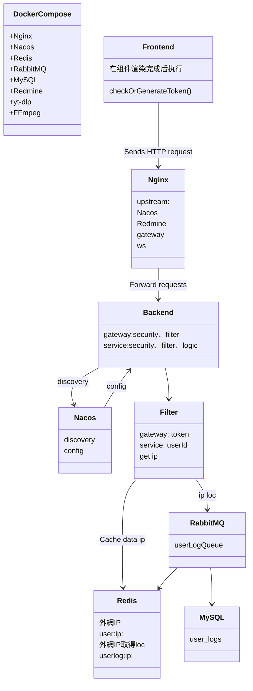
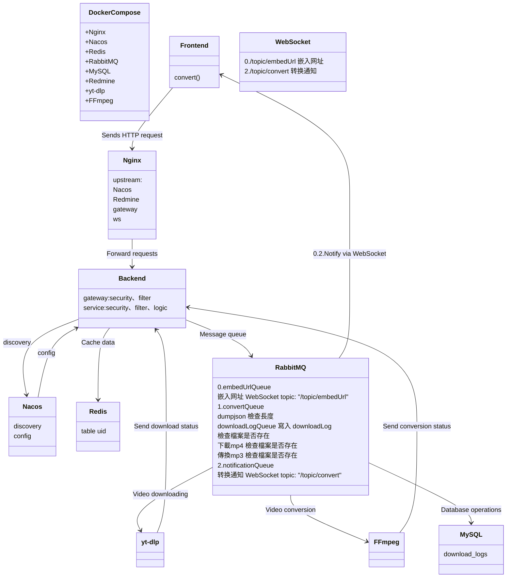
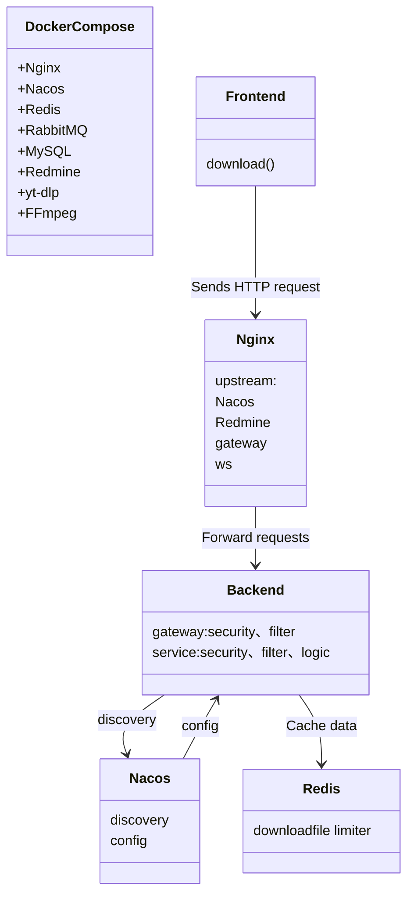

# yt1-log
## 2024-12-18 ~ 2024-12-19
start

1. vagrant + docker compose 
2. docker compose = nacos nginx mysql redmine

---

關於 nacos 負載均衡 nginx 負載均衡、反向代理

### 負載均衡：
1. 分散請求：負載均衡將請求分散到多個服務實例上，避免單一服務承受過多負載，從而提高系統的穩定性和可用性。
2. 提高可用性：如果一個服務實例出現故障，負載均衡可以自動將流量導向其他可用實例，從而保證服務不中斷。
3. 擴展性：隨著業務增長，通過增加更多的服務實例，負載均衡可以輕鬆地應對更多的請求，而無需大幅修改系統架構。

我這邊gateway、service都只有一個服務
負載均衡需要啟動了一個以上的實例，Gateway 在這些實例之間輪循，確保請求均勻分佈，從而實現負載均衡。


### 反向代理：
1. 集中管理請求：反向代理作為客戶端和服務之間的中介，可以集中管理和控制所有進入的請求，比如通過 Nginx 或 Apache 等軟件。
2. 安全性增強：反向代理可以隱藏後端服務的具體地址，提供一層額外的安全保護，防止直接攻擊後端服務。

安全性
```
location /app/ {
    rewrite ^/app/(.*)$ /$1 break;  # 去掉 /app 前缀
}
```

3. 負載均衡的前置條件：反向代理常常與負載均衡結合使用，幫助分發請求到多個後端服務。
4. 緩存與性能優化：反向代理可以緩存靜態資源或頻繁訪問的內容，從而減少後端服務的負擔，提升響應速度。


### Nacos 與反向代理的關係：
雖然 Nacos 本身不做反向代理，
但它與反向代理工具（如 Nginx、Spring Cloud Gateway）配合使用非常重要。
反向代理工具可以基於 Nacos 註冊的服務動態地進行負載均衡和請求轉發。

### Vagrantfile 定義虛擬機的配置
在虛擬機內部安裝 Docker 和 Docker Compose
使用 docker-compose.yml 文件來定義應用的多個服務

### frontend 
1. chatgpt
2. https://websim.ai/ copy contentWindow
3. Using Vue from CDN

### backend
1. gateway 
2. service

---

## 2024-12-30 ~ 2024-12-31
1. window 工具
下載 ytdlp、轉換 ffmpeg
2. frontend
想增加做下載中轉圈、可以選擇mp3、mp4

---

## 2025-01-01 
1. ytdlp 文字編碼問題
2. mq+socket

下載轉換做異步處理，等太久
請求可以更快回去然後先給用戶一個訊息說，正在下載、轉換中
```javascript 

await axios.post('/yt1/convert', {
                url: this.url,
                format: this.format
            }).then(response => {
                if (response.data.success === true) {
                    this.downloadformat = this.isMP4 ? 'mp4' : 'mp3';
                    this.errorMessage = '';
                    this.successMessage = `Your ${this.format.toUpperCase()} conversion is in progress. A download link will be available shortly!`;
                
                }else if(response.data.success === false){
                    this.errorMessage = response.data.message;
                    this.successMessage = '';
                }
```
一開始是用 Executors.newSingleThreadExecutor()

### 關於大任務小任務：

1. RabbitMQ：适用于 大规模任务处理 和 分布式架构。

convert() 屬於大任務
基於以下原因：
資源消耗高：轉換操作需要消耗大量 CPU 和 I/O 資源。
運行時間不確定：處理視頻長短和解析度不同，運行時間可能變化較大。
可能的併發需求：如果需要處理多個視頻，系統負載會迅速增長。

2. Executors.newSingleThreadExecutor()：适用于 小规模任务 和 本地处理。

---

## 2025-01-02

RabbitMQ
```java
//-- configuration file --
rabbitmq:
  user-log-queue: userLogQueue

//-- RabbitMQConfig --
@Bean
public Queue userLogQueue() {);
    return new Queue("userLogQueue", true);
}

//-- Listener --
@RabbitListener(queues = "${rabbitmq.user-log-queue}")
public void handleUserLog(UserLog userLog) {
    log.info("userLog:{}",userLog);
    // 後續處理
}

//-- send q --
rabbitTemplate.convertAndSend("userLogQueue", "your T");

//-- RabbitResponse - send q and catch --
rabbitResponse.queueMessageLog("userLogQueue", "your T");

```
主要分成
downloadQueue 下載任務
convertQueue 轉換任務完成後，發消息給通知任務

---

## 2025-01-03 ~ 2025-01-05

Gateway 使用 WebFlux，而後端服務使用 Spring MVC（Web）
一開始是打算在 Gateway filter 存download log 的數據到數據庫
WebFlux 要調用其他包遇到一些問題搞很久(比如循環依賴)
把後端服務改成 WebFlux後來發現ws 傳不過來，因為對ws也不熟所以最後又改回Web
睡覺起來在想到一開始就弄錯了
業務邏輯完全不該在Gateway這邊做

### WebFlux與Web：

Spring Cloud Gateway 基於 WebFlux，
它是反應式編程模型，適合處理高併發和非阻塞的 I/O 操作。

Spring MVC 是傳統的基於 Servlet 的同步模型，
更適合處理阻塞操作，並且與大多數現有的 Spring 應用程式兼容。

### 併發和阻塞：

高併發是同時有很多請求
一個網站同時有很多人訪問，就是高併發的場景。

阻塞和非阻塞是處理這些請求時，系統是否讓請求排隊等待資源
阻塞：一個請求在等待資源（比如數據庫查詢、檔案讀寫）完成之前，會一直佔用系統資源。
這樣會導致其他請求需要排隊等待，尤其在高併發情況下，可能會出現長時間等待。

非阻塞：請求發出後，不會等待資源完成，而是立即返回，讓系統可以繼續處理其他請求。
當資源準備好後，再通知請求繼續。這樣可以更高效地利用資源，特別是在高併發場景下。

downloadLogQueue 下載任務前先將存數據

---

## 2025-01-06

nginx
upstream: ws

```
    location /ws {
        proxy_pass http://ws;
        proxy_http_version 1.1;
        proxy_set_header Upgrade $http_upgrade;
        proxy_set_header Connection "Upgrade";
        proxy_set_header Host $host;
        
        # 支持 SockJS 的长轮询和其他请求
        proxy_set_header X-Real-IP $remote_addr;
        proxy_set_header X-Forwarded-For $proxy_add_x_forwarded_for;
        proxy_set_header X-Forwarded-Proto $scheme;
    }
```

### backend
bucket4j downloadLimiter
先有這個想法
防止用戶一直按下載，後來改成redis

### RabbitMQ
notificationQueue 转换通知
embedUrlQueue 嵌入网址


### WebSocket
/topic/convert 转换通知
/topic/embedUrl 嵌入网址

```javascript

        connectws() {
            const socket = new SockJS('http://localhost:8801/ws'); // Nginx 或直接访问 Spring Boot 地址
            const client = webstomp.over(socket);
            
            client.connect(
                {},
                () => {
                    console.log("Connected to WebSocket");
                    // 订阅主题
                    client.subscribe("/topic/convert", (message) => {
                        this.filename = message.body;
                        this.successMessage = `You can download now! Please check your browser's download folder.`;
                        console.log("Received message: ", message.body);
                    });
                    client.subscribe("/topic/embedUrl", (message) => {
                        this.embedUrl = message.body;
                        console.log("Received message: ", message.body);
                    });
                },
                (error) => {
                    console.error("Connection error: ", error);
                }
            );
            
        },
```
主要就是在處理 convertQueue 轉換任務完成後，發消息給通知任務
```html 
<button v-if="filename" @click="downloadMP3">Download {{ downloadformat.toUpperCase() }}</button>
        <div class="error">
          {{ errorMessage }}
      </div>
      <div class="success">
        {{ successMessage }}
    </div>
```

跟一開始拿到影片連結，嵌入网址給用戶等待下載跟轉換任務還沒有下載按鈕的時候可以先看下影片
```html
<div v-if="embedUrl" class="embedUrl">
      <iframe :src="embedUrl" title="YouTube video player" frameborder="0" allow="accelerometer; autoplay; clipboard-write; encrypted-media; gyroscope; picture-in-picture; web-share" referrerpolicy="strict-origin-when-cross-origin" allowfullscreen></iframe>
    </div>
```

---

## 2025-01-07

AWS IAM for EC2

---

## 2025-01-08

1. mybatis 改 JPA
2. ApiResponse 統一返回 ResponseEntity 比較好看
3. 為甚麼要統一返回200?
4. 防止用戶一直按下載 30秒才能再按一次下載
redis
```java
String requestHash = hashUtils.generateRequestHash(ip + ":" + filename);

if (!downloadLimiter.tryDownload(requestHash)) {
            return ResponseUtils.httpStatus2ApiResponse(CustomHttpStatus.TOO_MANY_REQUESTS);
        }

        Boolean isSet = stringRedisTemplate.opsForValue().setIfAbsent(requestHash, String.valueOf(now),
                DUPLICATE_REQUEST_INTERVAL_MS, TimeUnit.MILLISECONDS);
        // 如果 Redis 中已存在相同键（且未过期），则请求重复。如果键不存在，则记录请求并允许通过
        return !Boolean.FALSE.equals(isSet);
```

---

## 2025-01-11

---

## 2025-01-12

打包佈署 v1 到docker compose 測試
```
mvn clean package -DskipTests
```

---

## 2025-01-13

yt-dlp 和 ffmpeg 从 Windows 切换到 Linux 环境

---

## 2025-01-14
AWS EC2

---

## 2025-01-15

1. yt-dlp 和 ffmpeg 从 Windows 切换到 Linux 环境
2. @Autowired 改 构造函数注入

```java 
// @Autowired 提供了更簡單的注入方式，但可能隱藏了依賴關係。
// 構造函數注入 提供了更好的可控性和測試性，
@RestController
@RequestMapping("/api/v1/yt1")
public class YouTubeController {

    private final YVCService yVCService;
    private final HashUtils hashUtils;
    private final RedisIdWorker redisIdWorker;

    public YouTubeController(YVCService yVCService ,HashUtils hashUtils ,RedisIdWorker redisIdWorker) {
        this.yVCService = yVCService;
        this.hashUtils = hashUtils;
        this.redisIdWorker = redisIdWorker;
    }
}

```

添加 user_logs 表来存储用户位置数据并与 download_logs 链接，user_id 建立外键关系

---

## 2025-01-16

add ip loc

---

## 2025-01-17

測試yt-dlp 和 ffmpeg 从 Windows 切换到 Linux 环境

```bash
# json get video detail
sudo docker compose run ytdlp --dump-json '%s' | jq '{id, title, ext, duration}'

# ytdlp 會自動調用ffmpeg mp4
sudo docker compose run ytdlp -- yt-dlp --config-location /config/yt-dlp.conf -o '%s'

# ffmpeg mp3
sudo docker compose run --rm ffmpeg -i '/downloads/%s.mp4' -q:a 0 -map a '/downloads/%s.mp3
```
cat ~/config/yt-dlp.conf
```conf
--output /downloads/%(title)s.%(ext)s
--format "bestvideo[ext=mp4]+bestaudio[ext=m4a]/best"
--merge-output-format mp4
```
---

## 2025-01-18 

基礎架構與服務交互圖

token
:::spoiler 




:::

yt convert
:::spoiler




:::


yt download
:::spoiler




:::

---


## 2025-01-19
queue 裡面的方法整理一下
下載前檢查檔案 mp4
mp3才要轉換
轉換完發消息通知

---

## 2025-01-20 ~ 2025-01-21

jwt
一開始是透過IP取經緯度
取經緯度主要想練習geo yt總部的距離因為挺搞笑但後來沒做
request經過反向代理都會取到自己內網IP
所以需要打api1取得用戶外網IP
然後再透過api2用外網IP取得location
但這樣每次進網站因為不知道是誰都要先打兩個api
後來為了身分辨識所以加上jwt
gateway filter set header user-id 到下游

```java 
// 修改 request，加入 user id
                ServerHttpRequest modifiedRequest = request.mutate()
                        .header(USER_ID_HEADER, userId)
                        .build();
```
service 在去set ThreadLocal 
不過有遇到queue+ThreadLocal問題
這邊在service filter 先打api1取得用戶外網IP 存redis
打userId丟進queue 
要透過api2用外網IP取得location
因為不同進程 queue 這邊在set ThreadLocal 進到接下來的方法就get得到了

ttl是10hr
關閉瀏覽器後，localStorage 內的token不會消失，除非是無痕模式，或用戶手動清除

---

## 2025-01-22

1. 整理日誌
2. token 過期 catch ExpiredJwtException 
3. vargant docker compose 打包佈署成功v2
